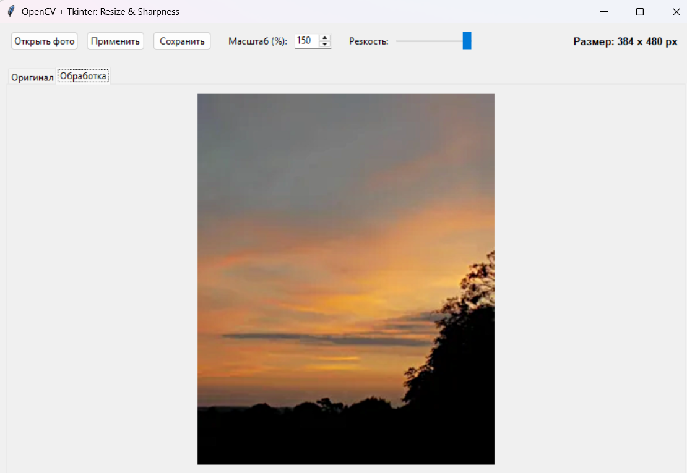

# Работа: Изменение размера и наложение резкости (Tkinter + OpenCV + ООП)

Программа выполнена по Варианту 7.

## Использованные технологии:
- **Tkinter** — построение графического интерфейса пользователя (GUI).
- **OpenCV** — попиксельная и матричная обработка изображений.
- **ООП** — разделение логики на класс интерфейса `App` и класс обработки `Processor`.

## Реализованный функционал:
- Пропорциональное изменение масштаба изображения на основе процентов из GUI (диапазон от 20% до 150%).
- Регулировка резкости методом нерезкого маскирования (Unsharp Masking) по формуле `cv2.addWeighted`.
- Интерфейс с двумя вкладками для удобного сравнения ("Оригинал" и "Обработка").
- Вывод новых размеров итоговой картинки в пикселях.
- Сохранение полученного результата обратно на жесткий диск.

## Пример работы программы:

